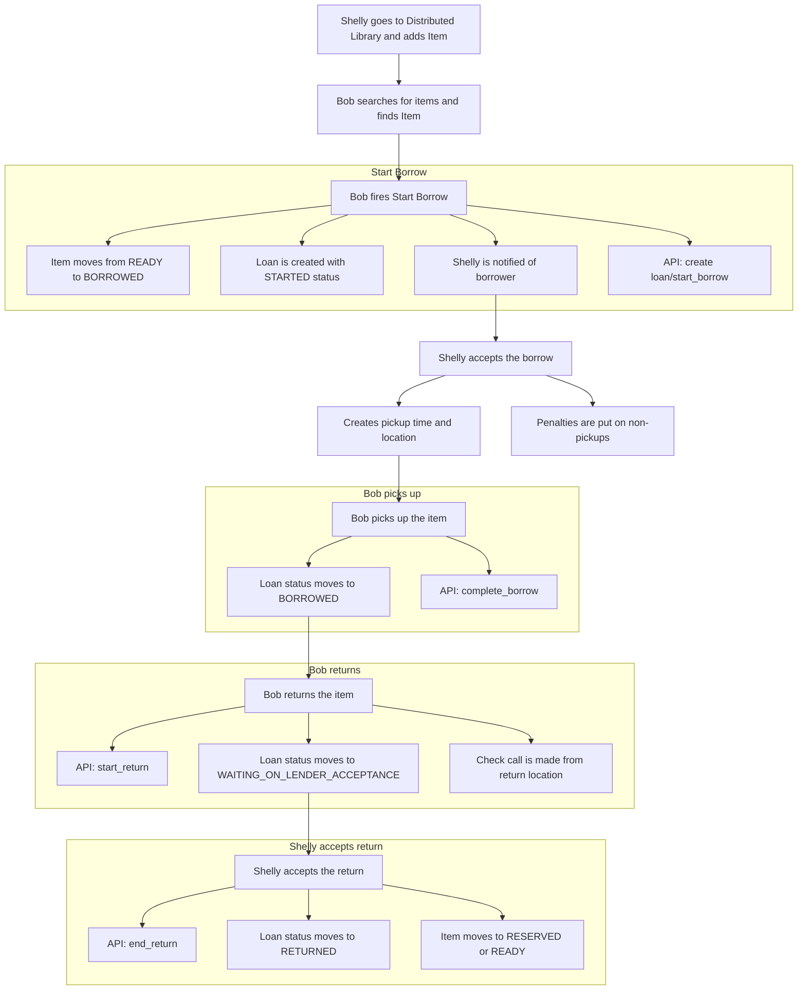

# Basic library flows

## Distributed library
Shelly has an item they want to loan out - a vacuum cleaner.

Bob has use for that item and wants to use it.

### List
Shelly goes to the Distributed Library and adds the Item.

Bob searches for items, and finds the Item.

Bob fires "Start Borrow".  
This
- moves the item out of READY status to BORROWED
- creates the loan with STARTED status
- notifies Shelly there is a borrower
- api - create the loan/start_borrow

Shelly accepts the borrow
- creates a pickup time and location for the item
- puts penalties on people who do not pick up the item

Bob picks up the item
- loan status moves to "BORROWED"
- api - complete_borrow

Bob returns the item
- api call - start_return
- loan status moves to "WAITING_ON_LENDER_ACCEPTANCE"
- check call is made from return location

Shelly accepts the return
- api call - end_return
- loan status moves to "RETURNED"
- item moves to either "RESERVED" if there's a wait, or "READY" if not

